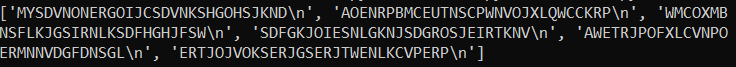
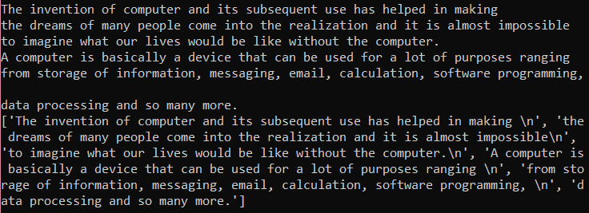
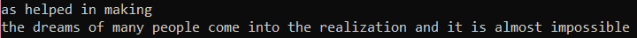

# File
## Reading File
1.
- create python file [readDNA.py](https://github.com/0732sta/starter-python/blob/master/file/readDNA.py)
- create reading text file [dna_sequence.txt](https://github.com/0732sta/starter-python/blob/master/file/dna_sequence.txt) and copy all the words
- then, **the output** : shows the dna code 
 

2.
- create python file [read.py](https://github.com/0732sta/starter-python/blob/master/file/read.py)
- create reading text file [ipsum.txt](https://github.com/0732sta/starter-python/blob/master/file/ipsum.txt) and copy all the words
- then, **the output** : 
 

3.
- create python file [read.py](https://github.com/0732sta/starter-python/blob/master/file/read.py)
- create reading text file [ipsum.txt](https://github.com/0732sta/starter-python/blob/master/file/ipsum.txt) and copy all the words
- then, **the output** : shows start from index 50 until next index 100
 

## Writing File
