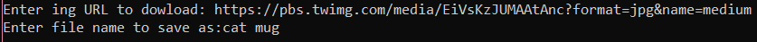
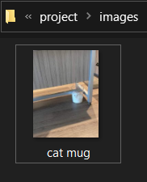

## Project
1. [Bar Tab Calculator](#Bar-Tab-Calculator)
2. [Themed Lorem Ipsum Generator](#Themed-Lorem-Ipsum-Generator)
3. [Dowload image from URL](#Dowload-image-from-URL)

### Bar Tab Calculator
- locate **project** folder
```bash
python
```
- import class Tab in [bar_tab.py](https://github.com/0732sta/starter-python/blob/master/project/bar_tab.py) 
```bash
from bar_tab import Tab
```
- create new instance, for example table1
```bash
table1=Tab()
```
```bash
table1
```
- then, add any item from the menu
```bash
table1.add('soft_drink')
table1.add('chicken')
table1.add('desert')
table1.print_bill(10,10)
```
- **the output :**


### Themed Lorem Ipsum Generator
- create python file [ipsum_gen.py](https://github.com/0732sta/starter-python/blob/master/project/ipsum_gen.py)
- create reading file ipsum.txt and copy all the words
- create writing file stud_ipsum.txt for show the output 
- open cmd
- locate the folder of ipsum_gen.py file
```bash
cd 'yourfolder'
```
- Then, you can see the output from the input that you wrote in ipsum_gen.py
```bash
python ipsum_gen.py
```
- **the output :** shows in [stud_ipsum.txt](https://github.com/0732sta/starter-python/blob/master/project/stud_ipsum.txt) file

### Dowload image from URL
- create python file[dl_img.py](https://github.com/0732sta/starter-python/blob/master/project/dl_img.py)
- then, create new folder *image* to store the image dowloaded
- locate the folder of dl_img.py file
```bash
cd 'yourfolder'
```
- Then, you can see the output from the input that you wrote in dl_img.py
```bash
python dl_img.py
```
- **the output :**
  - copy this link to dowload the image as example : https://pbs.twimg.com/media/EiVsKzJUMAAtAnc?format=jpg&name=medium
  -  
  -  
