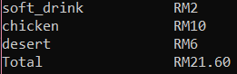

## Project
### Bar Tab Calculator
- locate **project** folder
```bash
python
```
- import class Tab in [bar_tab.py](https://github.com/0732sta/starter-python/blob/master/project/bar_tab.py) 
```bash
from bar_tab import Tab
```
- create new instance, for example table1
```bash
table1=Tab()
```
```bash
table1
```
- then, add any item from the menu
```bash
table1.add('soft_drink')
table1.add('chicken')
table1.add('desert')
table1.print_bill(10,10)
```
- the output :


