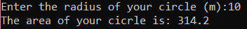
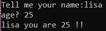
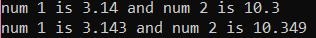
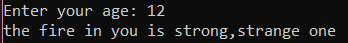
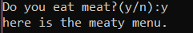
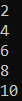
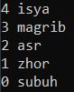
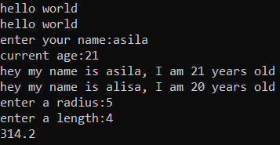
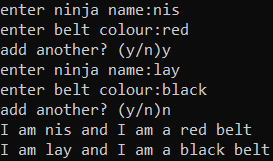

### List
  1. [Standard Input](#Standard-Input) 
  2. String Formatting
  3. If statement
  4. For Loop
  5. While Loop
  6. Range
  7. Function
  8. Dictionary
### Step
  1. create python file ['area_calc.py'](https://github.com/0732sta/starter-python/blob/master/standard-input/area_calc.py)
  2. open cmd
  3. locate the folder of 'area_calc.py' file
  ```bash
  cd 'yourfolder'
  ```
  4. Then, you can see the output from the input that you wrote in 'area_calc.py'
  ```bash
  python area_calc.py
  ```
  5. Play around with code by remove'#hash' inside the python file
## Standard Input  
- Follow the [Step](#Step) 
- but create and use the new python file ['area_calc.py'](https://github.com/0732sta/starter-python/blob/master/standard-input/area_calc.py)
### For example :




## 2. String Formatting
- Follow the [Step](#Step) 
- but create and use the new python file ['string_format.py'](https://github.com/0732sta/starter-python/blob/master/standard-input/string_format.py)
### For example :


## 3. If Statemnt
- Follow the [Step](#Step) 
- but create and use the new python file ['if_elif.py'](https://github.com/0732sta/starter-python/blob/master/standard-input/if_elif.py)
### For example :




## 4. For Loop
- Follow the [Step](#Step) 
- but create and use the new python file ['loops.py'](https://github.com/0732sta/starter-python/blob/master/standard-input/loops.py)

## 5. While Loop
- Follow the [Step](#Step) 
- but create and use the new python file ['while-loop.py'](https://github.com/0732sta/starter-python/blob/master/standard-input/while-loop.py)
### For example :


## 6. Range
- Follow the [Step](#Step) 
- but create and use the new python file ['range.py'](https://github.com/0732sta/starter-python/blob/master/standard-input/range.py)
### For example :


## 7. Function
- Follow the [Step](#Step) 
- but create and use the new python file ['function.py'](https://github.com/0732sta/starter-python/blob/master/standard-input/function.py)
### For example :


## 8. Dictionary
- Follow the [Step](#Step) 
- but create and use the new python file ['dictionary.py'](https://github.com/0732sta/starter-python/blob/master/standard-input/dictionary.py)
### For example :

