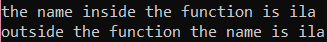

### List :
  1. [Standard Input](#Standard-Input) 
  2. [String Formatting](#String-Formatting)
  3. [If statement](#If-statement)
  4. [For Loop](#For-Loop)
  5. [While Loop](#While-Loop)
  6. [Range](#Range)
  7. [Function](#Function)
  8. [Dictionary](#Dictionary)
  9. [Scope](#Scope)
  10. [Set](#Set)
  11. [Class](#Class)
  12. [Modules & Packages](#Modules-!&-Packages)
### Step 
  1. create python file [area_calc.py](https://github.com/0732sta/starter-python/blob/master/standard-input/area_calc.py)
  2. open cmd
  3. locate the folder of area_calc.py file
  ```bash
  cd 'yourfolder'
  ```
  4. Then, you can see the output from the input that you wrote in area_calc.py
  ```bash
  python area_calc.py
  ```
  5. Play around with code by remove'#hash' inside the python file
## Standard Input  
- Follow the [Step](#Step) 
- but create and use the new python file [area_calc.py](https://github.com/0732sta/starter-python/blob/master/standard-input/area_calc.py)
### For example 1 :


## String Formatting
- Follow the [Step](#Step) 
- but create and use the new python file [string_format.py](https://github.com/0732sta/starter-python/blob/master/standard-input/string_format.py)
### For example 2 :


## If Statement
- Follow the [Step](#Step) 
- but create and use the new python file [if_elif.py](https://github.com/0732sta/starter-python/blob/master/standard-input/if_elif.py)
### For example 3 :


## For Loop
- Follow the [Step](#Step) 
- but create and use the new python file [loops.py](https://github.com/0732sta/starter-python/blob/master/standard-input/loops.py)
### For example 5 :


## While Loop
- Follow the [Step](#Step) 
- but create and use the new python file [while-loop.py](https://github.com/0732sta/starter-python/blob/master/standard-input/while-loop.py)
### For example 5 :


## Range
- Follow the [Step](#Step) 
- but create and use the new python file [range.py](https://github.com/0732sta/starter-python/blob/master/standard-input/range.py)
### For example 6 :


## Function
- Follow the [Step](#Step) 
- but create and use the new python file [function.py](https://github.com/0732sta/starter-python/blob/master/standard-input/function.py)
### For example 7 :


## Dictionary
- Follow the [Step](#Step) 
- but create and use the new python file [dictionary.py](https://github.com/0732sta/starter-python/blob/master/standard-input/dictionary.py)
### For example 8 :


## Scope
- Follow the [Step](#Step) 
- but create and use the new python file [scope.py](https://github.com/0732sta/starter-python/blob/master/standard-input/scope.py)
### For example 9 :


## Set
- Follow the [Step](#Step) 
- but create and use the new python file [dictionary1.py](https://github.com/0732sta/starter-python/blob/master/standard-input/dictionary1.py)
- Also, simple implement function **set** and **sorted** go to file [sorting-set.py](https://github.com/0732sta/starter-python/blob/master/type/sorting-set.py)
### For example 10 :
Before put **set** | After put **set**
------------ | -------------
 | 

## Class
- Follow the [Step](#Step) 
- but create and use the new python file [classes.py](https://github.com/0732sta/starter-python/blob/master/standard-input/classes.py)
- Also, to learn more about class with **init fuction** do open [classes1.py](https://github.com/0732sta/starter-python/blob/master/standard-input/classes1.py)
- implement *class* and *static* **method** in file [classesm.py](https://github.com/0732sta/starter-python/blob/master/standard-input/classesm.py)
### For example 11 :
output [classes1.py](https://github.com/0732sta/starter-python/blob/master/standard-input/classes1.py) | output [classesm.py](https://github.com/0732sta/starter-python/blob/master/standard-input/classesm.py)
------------ | -------------
 | 

## Modules & Packages
- create new folder **space** inside your python folder that you create previously
- create 3 file inside **space** folder which is [__init__.py](),[calc.py](),[planet.py]()
- Then, to import package from space folder, we need to create file [classes-s.py]() outside of **space** folder 
### For example 12 :

